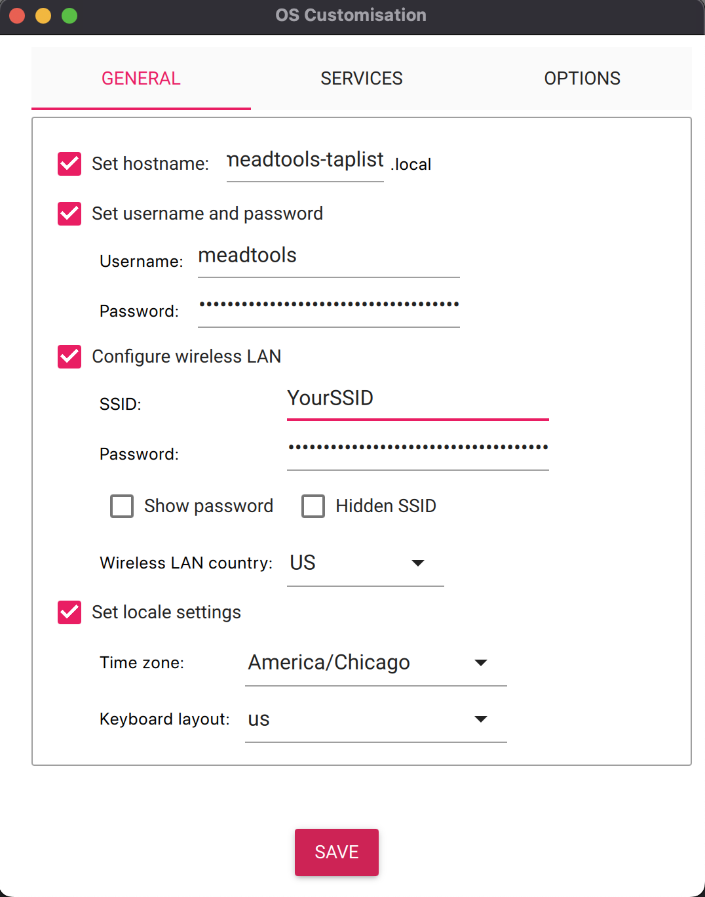

# MeadTools Taplist Setup (Raspberry Pi)

This project powers the **MeadTools Taplist Display System**, a full-screen taplist for HDMI displays with local editing over Wi-Fi. You can install it two ways:

---

## 🚀 Option 1: Use the Prebuilt OS Image (Fastest)

Download the full Raspberry Pi OS image with everything preinstalled and ready to go.

**➡️ [Get the Latest Image Release](https://github.com/ljreaux/meadtools-taplist/releases)** (look for `MeadTools-Taplist.img.gz`)

### How to Flash the Image

1. Download the `.img.gz` file from the release
2. Flash it to a microSD card (16 GB or larger) using:
   - [Raspberry Pi Imager](https://www.raspberrypi.com/software/)
   - OR [Balena Etcher](https://etcher.io/)

### ⚠️ Important Behavior Notes

- If you **do not preconfigure Wi-Fi** (recommended for beginners):

  - The Pi will boot into **Access Point mode**
  - A Wi-Fi network named **`Taplist Admin`** will appear
  - A **captive portal** will automatically show the admin dashboard

- If you **do preconfigure Wi-Fi** (e.g. using Raspberry Pi Imager’s Advanced Settings):
  - The Pi will **skip** Access Point mode and connect to your Wi-Fi
  - You must visit `http://<your-hostname>.local:5000/admin` or `http://<your-pi-ip>:5000/admin` to access the dashboard
  - This is useful for environments where the Pi is connected via Ethernet or joins a secure LAN

> 🧠 Tip: If you’re unsure, leave Wi-Fi unconfigured and use the access point for first-time setup.

## 🛠 Option 2: Install on Existing Raspberry Pi OS

Use this if you want to add the taplist to a Pi that’s already running Raspberry Pi OS (Bookworm recommended).

### One-Line Install

Run this on your Raspberry Pi (connected to Ethernet or Wi-Fi):

```bash
bash <(curl -s https://raw.githubusercontent.com/ljreaux/meadtools-taplist/main/pi/remote-setup.sh)
```

This will:

- Download setup files
- Install dependencies
- Set up the Flask server
- Configure autostart in kiosk mode
- Enable a Wi-Fi access point with captive portal

---

## ✅ What This Setup Provides

- Fullscreen taplist on HDMI at boot
- Flask server at `localhost:5000`
- Admin panel via local Wi-Fi access point
- No internet connection required for editing

---

## 📦 Files Included

| File                    | Purpose                                                |
| ----------------------- | ------------------------------------------------------ |
| `taplist-setup.sh`      | Main setup script for server and kiosk                 |
| `setup-access-point.sh` | Sets up Wi-Fi access point and captive portal          |
| `hostapd.conf`          | Configures the Wi-Fi access point (SSID, channel, etc) |
| `dnsmasq.conf`          | Handles DHCP and DNS routing for captive portal        |
| `dhcpcd.conf`           | Sets a static IP address for the Pi's Wi-Fi            |
| `remote-setup.sh`       | Minimal bootstrap script for downloading setup files   |

---

## 📁 Server Bundle (Downloaded During Setup)

Includes:

- `server.py` – Flask backend
- `public/index.html` – HDMI-facing display
- `public/admin.html` – Admin panel via Wi-Fi
- `public/taplist.json` – Tap list data (auto-edited)
- `public/images/` – Custom tap artwork

---

---

## 🧰 Headless Version (No HDMI, No Access Point)

If you’re running a Raspberry Pi without a display or want to host the taplist UI remotely (e.g., Android app, smart TV, Google TV, etc.), you can use the headless image or install the headless setup manually.

⚠️ Important: The headless version requires network access to function. Be sure to:

- Use Raspberry Pi Imager’s Advanced Settings to preconfigure Wi-Fi and enable SSH, or
- Plug in a USB Ethernet adapter

Otherwise, you will not be able to reach the Pi to view or edit the taplist.

### Option 1: Use the Prebuilt Headless OS Image

**➡️ [Get the Headless Image Release](https://github.com/ljreaux/meadtools-taplist/releases)** (look for `MeadTools-Taplist-Headless.img.gz`)

#### How to Flash the Image

1. Download the `MeadTools-Taplist-Headless.img.gz` file
2. Flash it to a microSD card using [Raspberry Pi Imager](https://www.raspberrypi.com/software/) or [Balena Etcher](https://etcher.io/)
3. (Optional but recommended) Use Raspberry Pi Imager’s "Advanced" settings to preconfigure Wi-Fi and enable SSH
4. Boot the Pi — the server will run in the background at `http://<pi-ip>:5000`

You can then point any smart device, browser, or app to the Pi’s IP address to load the display.

---

### 📷 Recommended Raspberry Pi Imager Settings

If you're using the headless version, you should configure advanced settings in Raspberry Pi Imager **before flashing** the image.

> These settings will allow your device to boot with Wi-Fi and SSH enabled, and you'll be able to access the taplist server at:  
> **[`http://meadtools-taplist.local:5000`](http://meadtools-taplist.local:5000)**

## 

### Option 2: Headless One-Line Setup (Lite OS OK)

If you already have a Raspberry Pi with 32-bit **Lite** Raspberry Pi OS installed:

```bash
bash <(curl -s https://raw.githubusercontent.com/ljreaux/meadtools-taplist/main/pi/headless-setup.sh)
```

This will:

- Download and install only the server bundle
- Set up the Flask server to run on boot
- Serve the taplist UI at `http://meadtools-taplist:5000`

> You can then display the interface from any device on the network.
> ⚠️ **Important Note:** If your Raspberry Pi is already connected to Wi-Fi before running this script (e.g. configured via Imager or ethernet), the access point will be skipped and the admin interface will only be reachable at `http://<your-hostname>.local:5000/admin` or `http://<your-pi-ip>:5000/admin`.

> 📛 If you change the Pi’s hostname, the `.local` address will reflect that (e.g., `http://my-custom-name.local:5000`).

---

Need help? [Open an issue](https://github.com/ljreaux/meadtools-taplist/issues).
